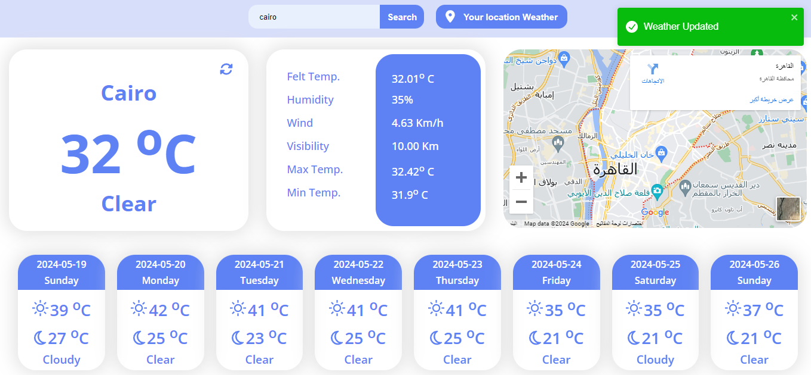

# Weather App

## Description

This is a simple weather app built using React.js. The app allows users to get current weather information for any city by fetching data from the OpenWeather API. It showcases a clean and user-friendly interface with dynamic weather updates.

## Features

- **Real-time Weather Data**: Get the latest weather updates for any city.
- **Responsive Design**: Optimized for both desktop and mobile devices.
- **User-friendly Interface**: Simple and intuitive design for a smooth user experience.

## Technologies Used

- **HTML**: For structuring the app.
- **CSS**: For styling the app.
- **JavaScript**: For adding interactive functionalities.
- **React.js**: For building the user interface.
- **OpenWeather API**: For fetching weather data.
